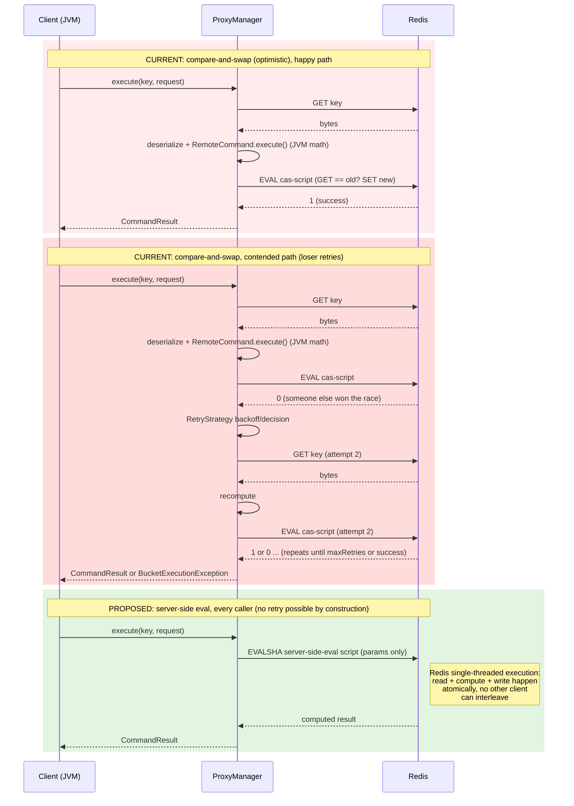

# RFC: a general "backend executes atomically" abstraction for distributed proxy managers

**Status: discussion opener, not a proposal to merge functional code.**

This document, and the skeleton classes it references under
`bucket4j-core/src/main/java/io/github/bucket4j/distributed/proxy/generic/server_side_eval/`,
exist to make one specific design question concrete enough to discuss: *should bucket4j
grow a general, backend-agnostic abstraction for "the backend computes and applies the
token-bucket math atomically, in one round trip", as a fourth sibling to the existing
`compare_and_swap`, `select_for_update` and `pessimistic_locking` proxy-manager families?*

It is **not** a request to merge a working feature. The attached Java files are
interfaces and an abstract class whose method bodies throw
`UnsupportedOperationException` — they compile (or are intended to), but they do
nothing, are not referenced anywhere else in the codebase, and no shipping
`RemoteCommand` implements the new interface. They exist purely so reviewers have real
method signatures, mirroring real existing base classes, to react to instead of
discussing an abstraction only in prose.

A companion, separate contribution ("Strategy 1" below) is a self-contained,
Redis-specific, working proof of concept and benchmark that motivates this question —
it does not depend on, or require, anything in this RFC to be accepted. This document
is the "should we generalize what Strategy 1 does" conversation; it is deliberately
opened *after* Strategy 1 exists so the discussion has real numbers behind it, per our
own internal research (`CAS-RETRY-RESEARCH-AND-CONTRIBUTION-PLAN.md`, §9.D).

## 1. Problem statement

Summarized from `CAS-RETRY-RESEARCH-AND-CONTRIBUTION-PLAN.md` (§1, §2, §5); see that
document for the full derivation.

bucket4j's Redis-backed (and, more generally, every
`AbstractCompareAndSwapBasedProxyManager`-based) proxy manager uses optimistic
concurrency control:

```
GET bytes -> deserialize -> apply RemoteCommand in the JVM -> serialize -> Lua CAS write
```

The Lua script Redis actually runs
(`bucket4j-redis/bucket4j-redis-common/src/main/java/io/github/bucket4j/redis/consts/LuaScripts.java:29-56`)
only performs the compare-and-set; Redis never computes token-bucket arithmetic. That
arithmetic runs client-side, between the `GET` and the CAS write, in
`BucketState64BitsInteger`.

Consequences under contention on a hot key:

1. **N concurrent requests on the same key → 1 winner, N−1 full retries**, each retry
   costing two additional Redis round trips (GET + EVAL).
2. Even with backoff (our short-term fix, `RetryStrategies.exponentialBackoffWithJitter`,
   already contributed separately), a `maxRetries`/time-budget cutoff means a request can
   be rejected (`BucketExecutionException`) purely due to contention timing, not because
   the bucket actually lacks tokens — an **unfairness**, not just a latency cost.

The only way to remove the race entirely, rather than manage it better, is to move the
read-compute-write into a single atomic server-side operation, so no other client can
observe or mutate the key mid-computation. Redis Lua `EVALSHA` is the concrete backend
we have in mind, but the question this RFC asks is whether that idea is worth
generalizing in `bucket4j-core`, or whether it should stay a Redis-specific class.

## 2. Proposed abstraction (skeleton only)

Sketch: a fourth family of proxy-manager base classes in
`bucket4j-core/src/main/java/io/github/bucket4j/distributed/proxy/generic/`, alongside
the three that exist today:

| Existing package | Base class | What varies |
|---|---|---|
| `compare_and_swap` | `AbstractCompareAndSwapBasedProxyManager` | optimistic GET + compare-and-set write |
| `select_for_update` | `AbstractSelectForUpdateBasedProxyManager` | pessimistic row lock via `SELECT ... FOR UPDATE` |
| `pessimistic_locking` | `AbstractLockBasedProxyManager` | explicit lock/unlock around read-modify-write |
| *(proposed)* `server_side_eval` | `AbstractServerSideEvalProxyManager` | **the backend itself executes the read-modify-write atomically; the client never round-trips the intermediate state** |

All three existing families share one property this proposal breaks from: they fetch
bytes, run `RemoteCommand.execute(...)` **client-side** in the JVM, and persist bytes
back — they only vary *how the lock/consistency is obtained*, not *where the
computation runs*. `AbstractServerSideEvalProxyManager` would be the first family where
the computation itself happens inside the backend.

Files added (all under
`bucket4j-core/src/main/java/io/github/bucket4j/distributed/proxy/generic/server_side_eval/`):

- `ServerSideEvaluableCommand.java` — capability interface a specific `RemoteCommand`
  could implement to declare it is eligible for, and describe how to perform, a
  server-side atomic evaluation.
- `AbstractServerSideEvalProxyManager.java` — abstract base class mirroring the shape of
  `AbstractCompareAndSwapBasedProxyManager`.
- `package-info.java` — explicit "experimental RFC skeleton, not wired in" notice.

### 2.1 Capability contract sketch

Modeled after `RemoteCommand`
(`bucket4j-core/src/main/java/io/github/bucket4j/distributed/remote/RemoteCommand.java:50-121`)
and `Request`
(`bucket4j-core/src/main/java/io/github/bucket4j/distributed/remote/Request.java:39-194`),
which are the real, current interfaces this would sit alongside:

```java
public interface ServerSideEvaluableCommand<T> {

    boolean isServerSideEvaluationSupported();

    Map<String, Object> exportServerSideEvaluationParameters();

    T reconstructResultFromServerSideEvaluation(Object rawServerSideResult);

}
```

No existing `RemoteCommand` implementation (`TryConsumeCommand`,
`TryConsumeAndReturnRemainingTokensCommand`, etc.) implements this interface as part of
this RFC — doing so is explicitly out of scope until the shape above is validated.

### 2.2 Base class sketch

Modeled after `AbstractCompareAndSwapBasedProxyManager`
(`bucket4j-core/src/main/java/io/github/bucket4j/distributed/proxy/generic/compare_and_swap/AbstractCompareAndSwapBasedProxyManager.java:46-103`):

```java
public abstract class AbstractServerSideEvalProxyManager<K> extends AbstractProxyManager<K> {

    protected AbstractServerSideEvalProxyManager(ClientSideConfig clientSideConfig) { ... }

    @Override
    public <T> CommandResult<T> execute(K key, Request<T> request) { ... }

    @Override
    public <T> CompletableFuture<CommandResult<T>> executeAsync(K key, Request<T> request) { ... }

    @Override
    protected CompletableFuture<Void> removeAsync(K key) { ... }

    protected abstract <T> CommandResult<T> evaluateServerSide(K key, Request<T> request);

    protected abstract <T> CompletableFuture<CommandResult<T>> evaluateServerSideAsync(K key, Request<T> request);

    protected <T> boolean isEligibleForServerSideEvaluation(Request<T> request) { ... }

}
```

Every method body in the actual skeleton file throws
`UnsupportedOperationException("RFC skeleton - not implemented, see
docs/rfc/server-side-execution-abstraction.md")`. There is no real dispatch, no real
fallback to `compare_and_swap`, no real Lua/EVALSHA call anywhere in this class.

## 3. Diagram: current CAS flow vs. proposed server-side-eval flow



The key structural difference: the CAS path always needs at least 2 round trips
(GET + EVAL) and, under contention, an unbounded (until `maxRetries`/budget) number of
additional GET+EVAL pairs per loser. The server-side-eval path needs exactly 1 round
trip (`EVALSHA`) regardless of contention, because Redis's single-threaded script
execution makes the "compare" step unnecessary — nobody else can observe or mutate the
key mid-script.

## 4. Open questions requiring maintainer input

These are stated honestly as **unresolved** — this RFC does not claim to have answers,
only to have identified the questions precisely enough to discuss:

1. **Versioning / rolling-upgrade interaction.** `distributed/versioning/Versions.java`
   today implements a linear, single-format handshake
   (`v_7_0_0` / `v_8_1_0` / `v_8_10_0`, checked via `Versions.check(formatNumber, min,
   max)`) for exactly one wire format. It has no concept of "format A vs. format B",
   only "how new/old is this one format." A server-side-eval path would use an entirely
   different wire representation (Lua `ARGV`/return values, not the serialized
   `RemoteCommand`/`Request` byte format), so introducing it raises a real protocol
   question this RFC does not resolve: how does a server-side-eval-capable client behave
   against a deployment/data written by an older, CAS-only client (and vice versa)
   during a rolling upgrade? Is this even a "version" in the `Versions.java` sense, or a
   completely orthogonal capability negotiation?

2. **Redis-only vs. genuinely backend-agnostic.** Today we have exactly one concrete
   backend need (Redis Lua). Is there a second real backend (e.g. a SQL stored
   procedure, an Ignite compute job) that would actually consume this abstraction, or
   would generalizing now be premature generalization for a single use case? A
   maintainer may reasonably ask "why not just add a Redis-specific
   `ProxyManager` class" (Strategy 1) until a second backend need materializes.

3. **`getProxyConfiguration` / dynamic reconfiguration without a stored serialized
   config.** The existing CAS path stores a serialized `BucketConfiguration` (or derives
   it from stored state) so `AbstractProxyManager.getProxyConfiguration` and
   `GetConfigurationCommand` can reconstruct it, and so `ReplaceConfigurationCommand`
   /`CheckConfigurationVersionAndExecuteCommand`-style reconfiguration works. If a
   server-side-eval backend stores state in a self-describing, non-serialized format
   (e.g. a Redis HASH with named fields, to avoid coupling to
   `BucketState64BitsInteger`'s undocumented internal layout — see the research doc,
   §9.A.2), how would dynamic reconfiguration and `getProxyConfiguration` work without
   either (a) also storing the full config redundantly, or (b) giving up on parity for
   that part of the API?

4. **Fallback story for ineligible configurations/commands.** The command surface today
   (`RemoteCommand`/`Request`, plus `CreateInitialStateAndExecuteCommand`,
   `VerboseCommand`, `MultiCommand`, `CheckConfigurationVersionAndExecuteCommand`) is
   broad. A server-side-eval path would realistically only ever support a narrow subset
   (e.g. single bandwidth, integer/fixed-interval refill, `tryConsume`-shaped commands).
   `isEligibleForServerSideEvaluation` in the skeleton is a placeholder for a check that
   does not exist anywhere in the codebase today (confirmed in the research doc, §5.1)
   — this RFC does not specify what happens when a request is ineligible: transparent
   fallback to a wrapped CAS-based manager? A build-time exception forcing the caller to
   choose explicitly? Something else? All are plausible; none is decided here.

5. **Is this new public API surface something maintainers want to own long-term?**
   `ServerSideEvaluableCommand` would be new public API in `bucket4j-core` that every
   downstream backend module (and any custom `RemoteCommand` implementation a user has
   written) would need to be compatible with going forward, subject to
   `backward-compatibility-policy.md`. This is exactly the kind of decision that needs
   sign-off *before* code is written, not after — which is the reason this is an RFC and
   not a PR against `bucket4j-core`'s real classes.

## 5. Relationship to the companion Strategy 1 PR

A separate, self-contained proof of concept (built by a different contribution effort,
referred to here as "Strategy 1") implements a working, benchmarked, Redis-specific
`ProxyManager`-adjacent class entirely outside `bucket4j-core`'s existing
`distributed/proxy/generic/` hierarchy — no core changes, no new public API, real Lua
script, real benchmark numbers (Redis commands per decision, p99 latency,
false-rejection rate, fairness). That PR is independently mergeable and does not depend
on anything in this RFC being accepted.

This RFC exists to ask a narrower, harder question that Strategy 1 deliberately avoids
committing to: *given that Strategy 1 works for Redis, is it worth generalizing into a
`bucket4j-core` abstraction other backends could also use?* Per our own research
(`CAS-RETRY-RESEARCH-AND-CONTRIBUTION-PLAN.md`, §9.D), we are explicitly **not**
proposing to merge the skeleton code in this RFC as functional — only to use it, and
this document, to open that discussion with maintainers, informed by Strategy 1's real
numbers rather than speculation.
